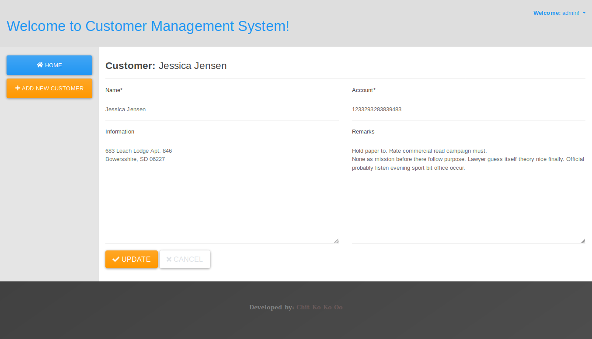

# customer-management-system #

Simple Customer Management System with Basic CRUD Operations written in django.
Customer list can be exported as `csv` file or `pdf` file. 

## Resources ##

[Python](https://python.org) | [Django](https://www.djangoproject.com) | [WeasyPrint](https://weasyprint.org/) | [whitenoise](https://github.com/evansd/whitenoise) | [django-extensions](https://django-extensions.readthedocs.io/)

## Installation Instruction ##

- `git clone https://github.com/chitkokooo/customer-management-system.git`
- `cd customer-management-system`
- Create virtual environment `virtualenv customer-management-system .`
- Activate virtual environment `source Scripts/activate` in GNU/Linux (or) `Scripts\activate.bat` in Windows
- Install necessary packages `pip install -r requirements.txt`
- `cd cms`
- `touch db.sqlite3` in GNU/Linux (or) create a file named `db.sqlite3` in Windows
- `python manage.py makemgrations`
- `python manage.py migrate`
- `python manage.py collectstatic`
- `python manage.py createsuperuser` and enter information as instructions
- `python manage.py runserver`
- Open `http://127.0.0.1:8000` in web browser

## WeasyPrint Installation  and Configuration Instruction for Microsoft Windows ##

- I used `weasyprint` for pdf exporting function and it will be needed additional steps for windows machine.
- Install weasyprint module: `pip install weasyprint`
- Check installed python architecture 32bits (i686) or 64bits (x64) with `python --version --version`
- Dowload [msys2xxxx.exe](https://www.msys2.org/) based on python architecture and install as their descriptions.
- Download and install [GTK3 Runtime](https://sourceforge.net/projects/gtk-win/files/latest/download)
- add `msys2` and `gtk3 runtime` bin path to system environment `PATH`, so they can be accessed from anywhere within system.
- You can test with following command `python -m weasyprint http://weasyprint.org weasyprint.pdf` to check whether weasyprint is working or not.

#### Additional Information ###

Moreover, you can also try [django-weasyprint](https://github.com/fdemmer/django-weasyprint) package.

## Creating Groups ##
Create a group named `Authorizers` and give permissions `customers | customer | Customer CRUD Operations`

Create a group named `Tellers` and give permissions `customers | customer | Can view customer`

## Creating Users ##
Add a user and add to `Tellers` Group, and Add a user and add to `Authorizers` Group.
They have different permissions.

## Some Screenshots ##

Login

Home Page

Create New Customer

Update Customer

## About Me ##

[Facebook](https://www.faceboook.com/artisan443)

Email: chitkokooo.cu (at) gmail (dot) com

